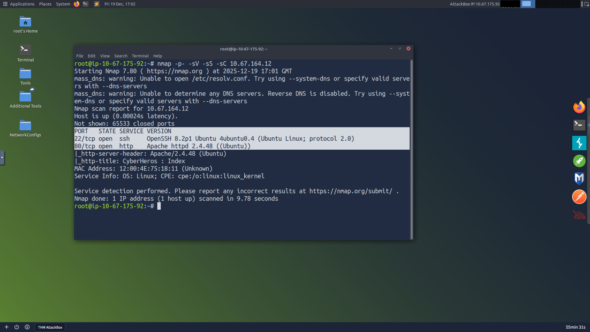
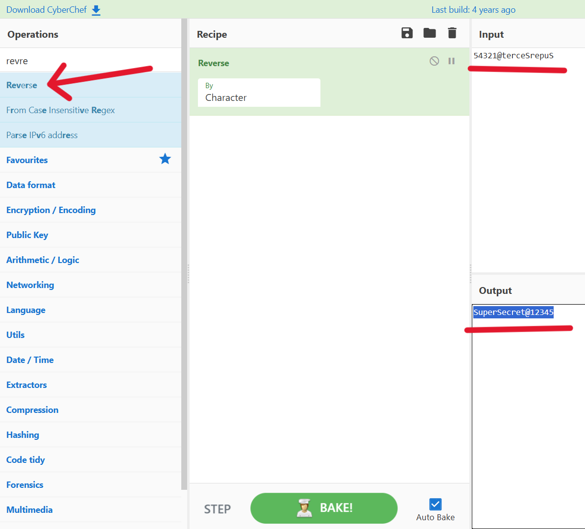
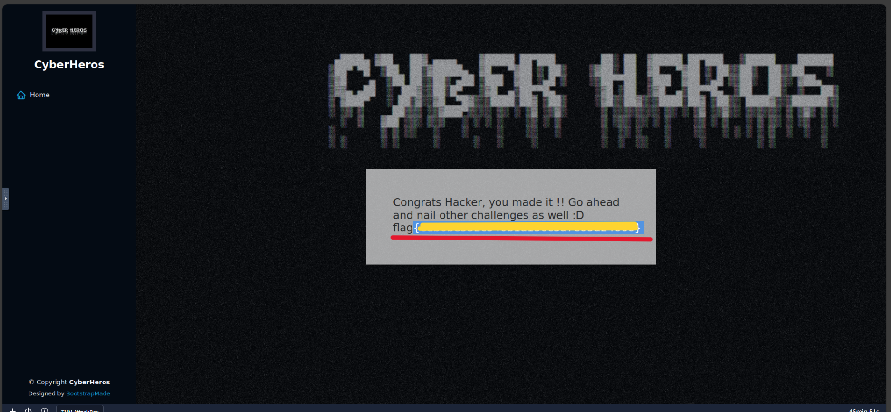

CyberHeroes
=============================================

Room        : CyberHeroes  
URL         : https://tryhackme.com/room/cyberheroes  
Vulnerability: Weak Authentication / Encoding Logic  
Author      : `Mr.Sima`  
TryHackMe   : [THM Profile](https://tryhackme.com/p/mrsima)

----------------------------------------------------
[+] Overview
----------------------------------------------------
In this challenge, I analyzed a vulnerable web
application that relies on weak authentication and
reversible encoding. The objective was to enumerate
the target, inspect the login mechanism, decode
credentials, and retrieve the flag.  

----------------------------------------------------
[+] Step 1: Network Enumeration
----------------------------------------------------
As an initial step, I performed network enumeration
to identify open ports and services running on the
target machine. This helps determine the available
attack surface before interacting with the
application.  

The following Nmap command was used:
```bash
nmap -sV -sS -A -p- 10.67.164.12
```

The scan revealed active services on the target,
confirming that a web service was available for
further investigation.  

----------------------------------------------------
[+] Step 2: Access the Application
----------------------------------------------------
Using the discovered service information, I opened
the target IP address in the browser, which loaded
the application landing page.  


----------------------------------------------------
[+] Step 3: Inspect the Login Page
----------------------------------------------------
I navigated to the login page and inspected the page
source using `Ctrl + U`  
  
From the source code, the username was hardcoded as:
```bash
h3ck3rBoi
```
The password was stored as a reversed string:
```bash
54321@terceSrepuS
```
----------------------------------------------------
[+] Step 4: Decode the Password
----------------------------------------------------
Based on the reversed password identified in the
previous step, I used **CyberChef** to decode it.  
  
By applying the **Reverse** operation in CyberChef
to the extracted string `54321@terceSrepuS`, the original plaintext
password was revealed:
```bash
SuperSecret@12345
```
----------------------------------------------------
[+] Step 5: Login and Retrieve Flag
----------------------------------------------------
Using the decoded credentials, authentication was
successful, and the flag was retrieved from the
application.  

flag{xxxxxxxxxxxxxxxxxxxxxxxxxxxxxxxx}

----------------------------------------------------
[+] Conclusion
----------------------------------------------------
This room highlights how weak authentication and
reversible encoding can be exploited. A structured
approach involving enumeration, inspection, and
basic decoding was sufficient to retrieve the flag.  

----------------------------------------------------
[+] Written by : `Mr.Sima`
----------------------------------------------------
