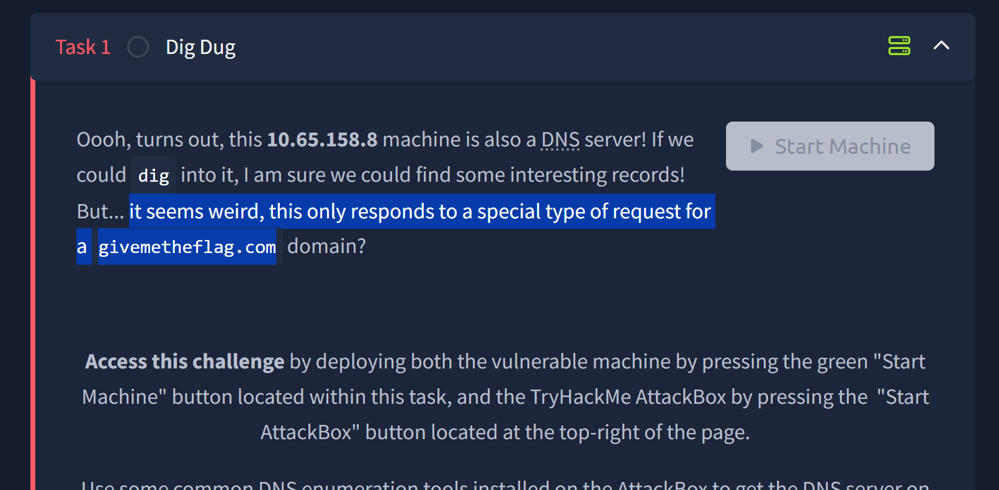
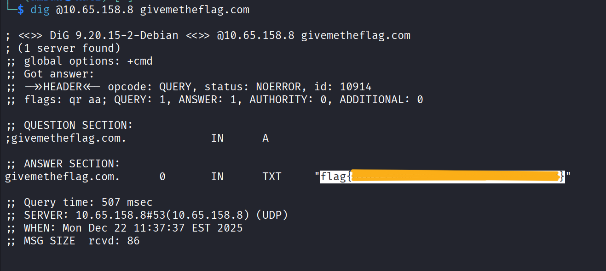

  
Dig Dug  
=============================================

Room        : Dig Dug  
URL         : https://tryhackme.com/room/digdug  
Vulnerability: DNS Misconfiguration (Restricted Query Handling)  
Author      : `Mr.Sima`  
TryHackMe   : [THM Profile](https://tryhackme.com/p/mrsima)

----------------------------------------------------
[+] Overview
----------------------------------------------------
In this room, I analyzed a DNS service that initially
appears unreachable when queried normally. Standard
DNS enumeration resulted in repeated timeouts.  

By carefully reviewing the task hints and performing
a targeted DNS query, it was discovered that the DNS
server only responds to a specific domain request,
which ultimately reveals the flag via a TXT record.

----------------------------------------------------
[+] Step 1: DNS Enumeration
----------------------------------------------------
As an initial step, I tested whether the target IP
`10.65.158.8` was responding to standard DNS queries.  

Command used:
```bash
dig @10.65.158.8
```


The request resulted in repeated timeouts, indicating
that the DNS server does not respond to generic
queries.

----------------------------------------------------
[+] Step 2: Hint Analysis
----------------------------------------------------
After observing the timeout behavior, I carefully
reviewed the task description for additional clues.  

  

The hint revealed that the DNS server only responds
to queries made for a specific domain:
```bash
givemetheflag.com
```
This confirmed that further enumeration should be
performed using the identified domain name.

----------------------------------------------------
[+] Step 3: Targeted DNS Query
----------------------------------------------------
Using the discovered domain, I performed a targeted
DNS query against the server.

Command used:
```bash
dig @10.65.158.8 givemetheflag.com
```  


The server successfully returned a TXT record
containing the flag.
```bash
flag{xxxxxxxxxxxxxxxxxxxxxxxxxxxxxxxx}
```

----------------------------------------------------
[+] Conclusion
----------------------------------------------------
This room demonstrates how DNS services can be
misconfigured to selectively respond only to
specific queries. By performing structured
enumeration, analyzing hints, and crafting a precise
dig request, the flag was successfully retrieved
from a DNS TXT record.

----------------------------------------------------
[+] Written by : `Mr.Sima`
----------------------------------------------------
