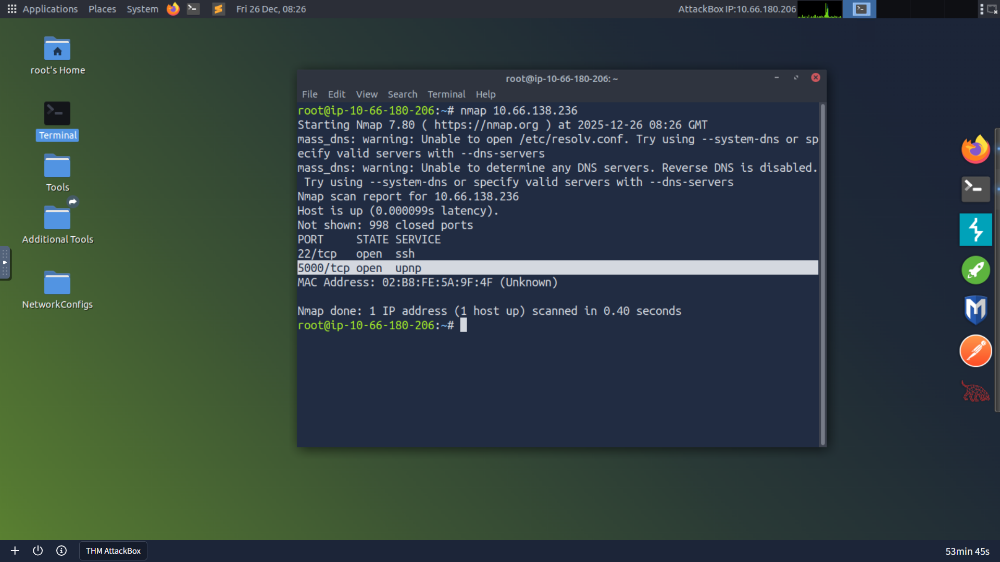
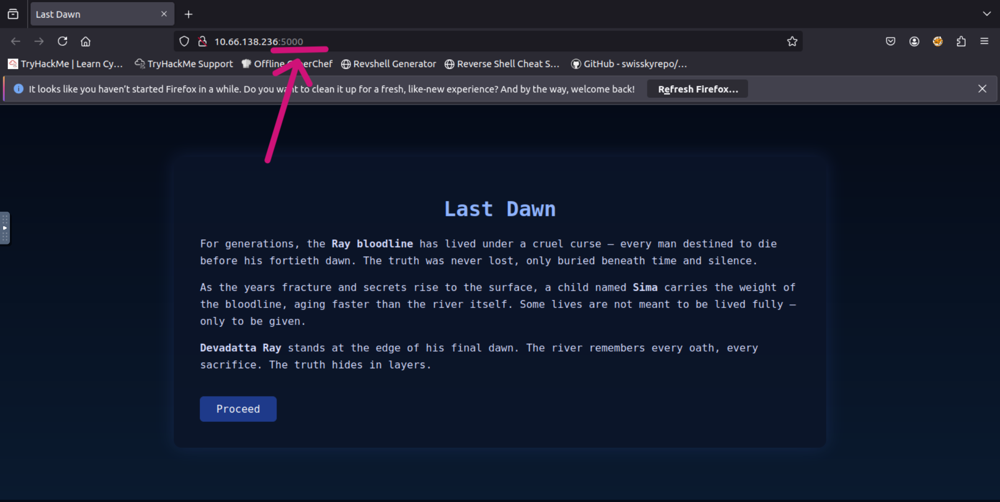
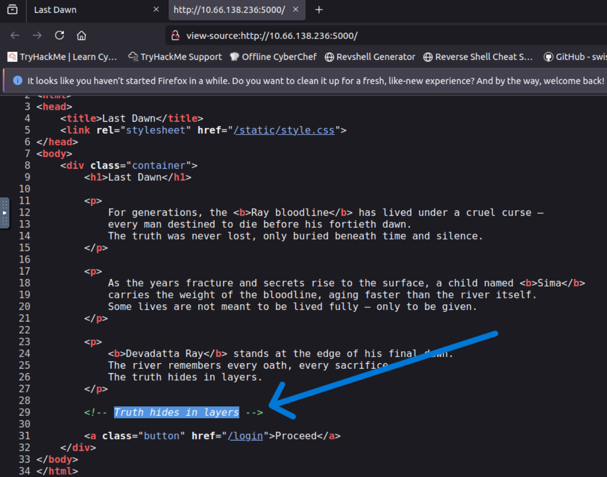
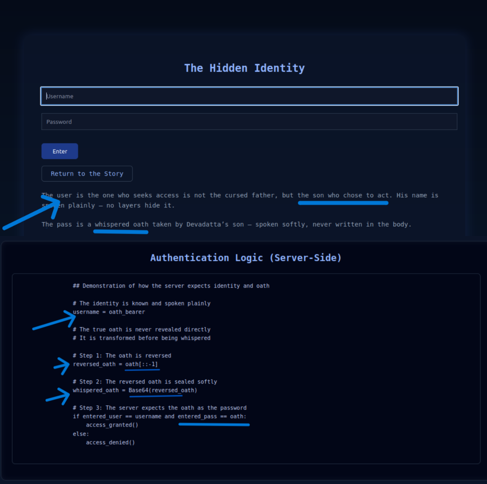
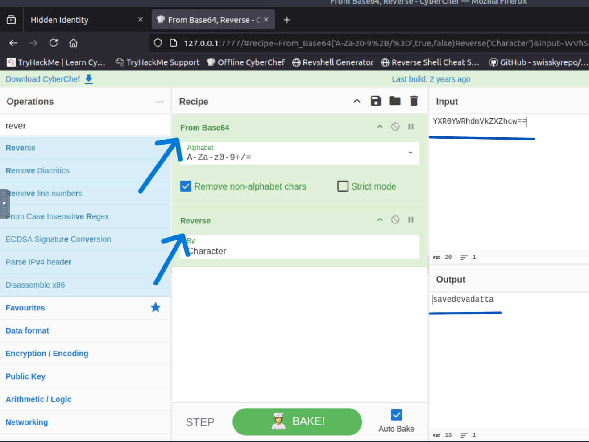
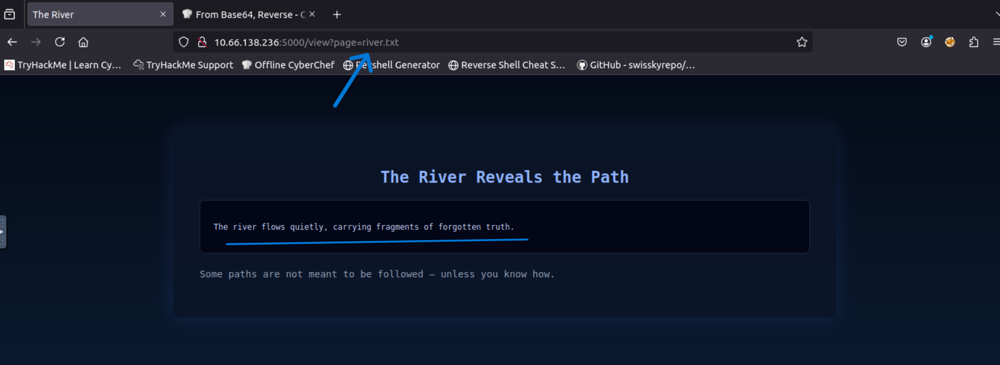
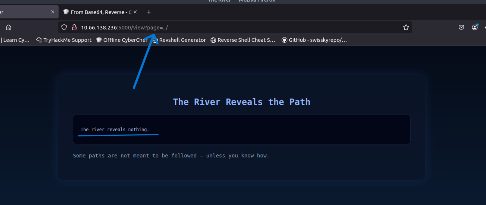
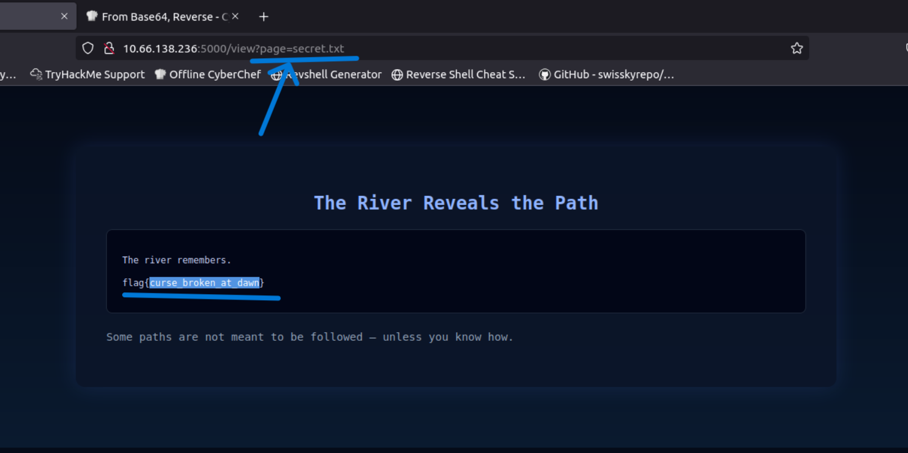

   

Last Dawn  
============================================================  
- **Room Name:** Last Dawn  
- **Room URL:** https://tryhackme.com/room/lastdawn  
- **Vulnerability:** Web – Encoding, Header Inspection, Path Traversal   
- **Author:** `MrSima`  
- **TryHackMe:** [THM Profile](https://tryhackme.com/p/mrsima)
 

------------------------------------------------------------
[+] Overview
------------------------------------------------------------
**Last Dawn** is a beginner-friendly web challenge focused on *observation over exploitation*.  
The room teaches how secrets are often hidden in layers rather than exposed directly.

The challenge walks through:
- Basic web reconnaissance
- Source code inspection
- Understanding encoded credentials
- Analyzing server-side authentication logic
- Exploiting a simple path traversal vulnerability

The story-driven approach reinforces the idea that **identity may be visible, but truth is often transformed**.

------------------------------------------------------------
[+] Task 2: Initial Reconnaissance
------------------------------------------------------------
The first step is to access the web application hosted on the target machine.  
A basic scan confirms that a web service is running.  
```bash
nmap <TARGET_IP>
```



Visiting the website reveals a minimal landing page.



Inspecting the page source uncovers an HTML comment:
```bash
<!-- Truth hides in layers -->
```  
This confirms that secrets are not directly exposed and must be derived step by step.



------------------------------------------------------------
[+] Task 3: Hidden Identity
------------------------------------------------------------
The login page introduces the core concept of the challenge:  
`one value is spoken plainly, the other is whispered.`

The username is directly tied to the story narrative.

From the context, the identity attempting to log in is:
```bash
Username: Sima
```



During failed login attempts, inspecting the HTTP response headers 
reveals an encoded value.


The encoded string observed is:
```bash
YXR0YWRhdmVkZXZhcw==
```

Decoding the value reveals the original oath (password).  
Using `CyberChef`:  
1. Base64 Decode    
2. Reverse string (as hinted by the server authentication logic)



Recovered credentials:
```bash
Username: sima
Password: savedevadatta
```  
Authentication succeeded using the recovered credentials.

------------------------------------------------------------
[+] Task 4: The River Reveals the Path
------------------------------------------------------------
After authentication, the application dynamically loads content.  
Observing the request behavior shows a parameter controlling which file is displayed.



The parameter is vulnerable to directory traversal.  
By manipulating the parameter value, it becomes possible to escape the intended directory.



Navigating to the restricted file reveals the final secret.



Flag:  
```bash
flag{xxxxxxxxxxxxxxxxxxxxx}
```

------------------------------------------------------------
[+] Conclusion
------------------------------------------------------------
**Last Dawn** effectively demonstrates how simple vulnerabilities can be hidden behind storytelling and subtle hints.

### Key takeaways:

* Always inspect page source and headers  
* Understand how data is transformed, not just where it appears  
* Never trust user-controlled file loading mechanisms  
* Logic flaws are often more dangerous than complex exploits
  
The room rewards patience, reasoning, and careful observation — ideal for beginners building strong web fundamentals.

------------------------------------------------------------
[+] Written by : `Mr.Sima`
------------------------------------------------------------


