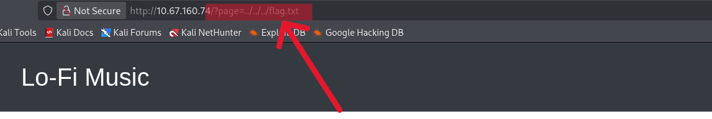

  
Lo-Fi
=============================================

Room        : Lo-Fi  
URL         : https://tryhackme.com/room/lofi  
Vulnerability: Local File Inclusion (Path Traversal)  
Author      : `Mr.Sima`  
TryHackMe   : [THM Profile](https://tryhackme.com/p/mrsima)

----------------------------------------------------
[+] Overview
----------------------------------------------------
In this room, I analyzed a vulnerable web application
that improperly handles user-supplied input through
a GET parameter. The application dynamically loads
pages without proper validation, making it vulnerable
to **Local File Inclusion (LFI)** via **path traversal**.

The objective was to enumerate the target, understand
the page-loading mechanism, exploit the vulnerability,
and retrieve the flag.

----------------------------------------------------
[+] Step 1: Network Enumeration
----------------------------------------------------
As an initial step, I performed basic network
enumeration to identify open ports on the target
machine. 

The following Nmap command was used:
```bash
nmap 10.67.160.74
```


The scan revealed:
```bash
Port 22 (SSH)
Port 80 (HTTP)
```  
Since a web service was available, further investigation
was focused on the HTTP application.  

----------------------------------------------------
[+] Step 2: Access the Application
----------------------------------------------------
I accessed the web application via the browser and
observed a simple music-themed website titled
“Lo-Fi Music”.

Navigation links revealed that content was loaded
dynamically using a URL parameter named `page`

Example:
```bash
http://10.67.160.74/?page=sleep.php
```


This indicated that backend file inclusion was being
performed based on user input.

----------------------------------------------------
[+] Step 3: Parameter Manipulation
----------------------------------------------------
To confirm file inclusion behavior, I attempted to
load a non-existent file via the `page` parameter.

Example:
```bash
http://10.67.160.74/?page=flag.txt
```  


The application returned a file-not-found message,
confirming unsanitized file handling logic.

----------------------------------------------------
[+] Step 4: Path Traversal Exploitation
----------------------------------------------------
After confirming file inclusion, I attempted a
path traversal attack to escape the current
directory and access sensitive files.

Payload used:
```bash
http://10.67.160.74/?page=../../../flag.txt
```



The traversal payload successfully bypassed directory
restrictions.

----------------------------------------------------
[+] Step 5: Retrieve the Flag
----------------------------------------------------
The traversal attack resulted in successful access
to the `flag.txt` file.


```bash
flag{xxxxxxxxxxxxxxxxxxxxxxxxxxxxxxxx}
```

----------------------------------------------------
[+] Conclusion
----------------------------------------------------
This room demonstrates how improper validation of
user-controlled input can lead to Local File
Inclusion vulnerabilities. By identifying dynamic
file loading behavior and exploiting path traversal,
it was possible to access sensitive files and retrieve
the flag.

----------------------------------------------------
[+] Written by : `Mr.Sima`
----------------------------------------------------
