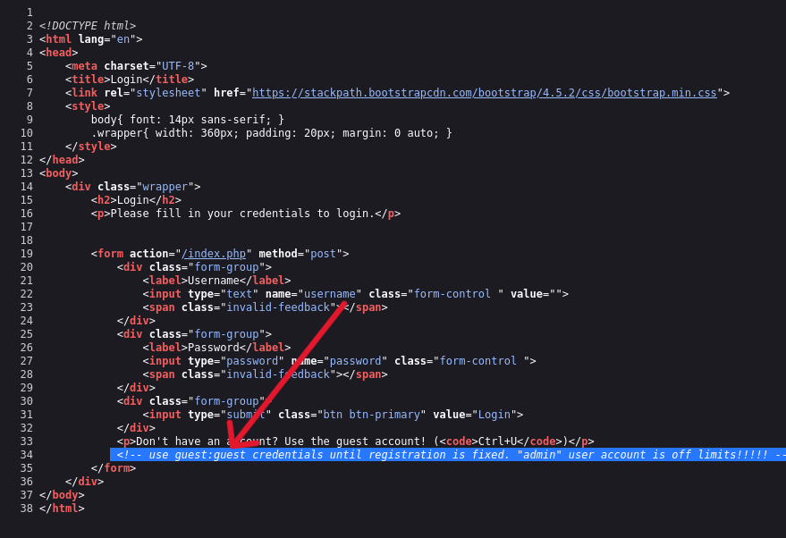

  
Neighbour
=============================================

Room        : Neighbour  
URL         : https://tryhackme.com/room/neighbour   
Vulnerability: IDOR (Insecure Direct Object Reference)  
Author      : `Mr.Sima`  
TryHackMe   : [THM Profile](https://tryhackme.com/p/mrsima)

----------------------------------------------------
[+] Overview
----------------------------------------------------
This room focuses on a basic web authorization issue (IDOR).
By modifying a URL parameter, it is possible to access
another user's profile and retrieve sensitive data.

----------------------------------------------------
[+] Step 1: Access the Application
----------------------------------------------------
After starting the machine, the web application is
available at:  
```bash
http://MACHINE_IP
```
The page shows a simple login form. 


----------------------------------------------------
[+] Step 2: Inspect Page Source
----------------------------------------------------
While checking the page source of the login page,
an HTML comment was found:

use `guest:guest` credentials until registration is fixed
This reveals valid login credentials.  



----------------------------------------------------
[+] Step 3: Login as Guest
----------------------------------------------------
Using the discovered credentials:
```bash
Username: guest  
Password: guest  
```
Login succeeds and redirects to a profile page.

The URL looks like:
```bash
profile.php?user=guest
```
----------------------------------------------------
[+] Step 4: Parameter Manipulation
----------------------------------------------------
The `user` parameter in the URL appears to control
which profile is displayed.
Changing the parameter from:
```bash
profile.php?user=guest
to:
profile.php?user=admin
```
loads the admin profile without any access checks. 


----------------------------------------------------
[+] Vulnerability Identified
----------------------------------------------------
The application does not verify whether the logged-in
user is authorized to view the requested profile.
This is an Insecure Direct Object Reference (IDOR).

----------------------------------------------------
[+] Flag
----------------------------------------------------
The flag is displayed on the admin profile page:
```bash
flag{xxxxxxxxxxxxxxxxxxxxxxxxxxxxxxxx}
```
----------------------------------------------------
[+] Conclusion
----------------------------------------------------
This room demonstrates why server-side authorization
checks are critical. Relying on user-controlled
parameters can easily lead to data exposure.

----------------------------------------------------
[+] Written by : `Mr.Sima`
----------------------------------------------------
